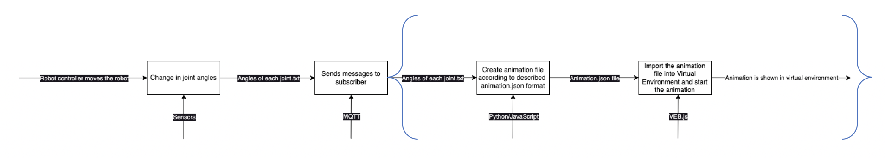
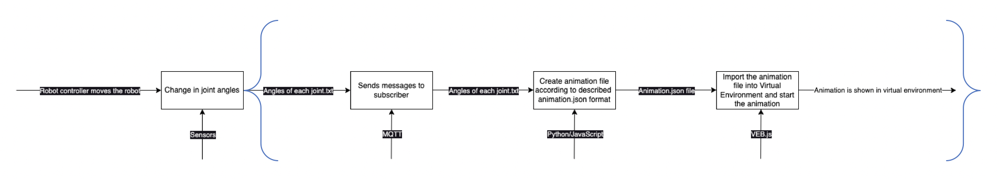

# **AVATAR Joint Learning Lab - Challenges of VR & Robotics Lab**

This document presents the challenges for the AVATAR JLL, making reference to the general [workflow documentation](JLL_doc.md#2-workflow). 
The aim of the challange is to make practice with digital twin and VR technologies addressing a simplified problem that still makes sense from an industrial perspective while using real data.

## *Scene Configuration*

The [PERFORM Lab](JLL_doc.md#1-perform-lab) is considered for the setup of the challenges. The scene is configured as described in the main documentation, with the addition of one or more workpieces on the conveyor.
Each challenge makes reference to its own scene configuration, thus highlighting the reconfigurability of the digital twin.

### Scene Configuration in VEB.js
VEB.js can be employed to visualize the [scene configuration](JLL_doc.md#23-visualization-in-vr-environment) using 1) local files or 2) specifying [URL parameters](https://virtualfactory.gitbook.io/vlft/tools/vebjs#url-parameters) pointing to remote files. In particular, the challenges will ask to personalize the animation. 
This is a full example showing the setting of all relevant URL parameters, if the second option is chosen:

http://ec2-54-174-51-194.compute-1.amazonaws.com/vebjs/?inputscene=https://difactory.github.io/repository/scenes/VL/PERFORM.json&repoMod3d=https://difactory.github.io/repository/models/VL/PERFORM/&inputanim=https://difactory.github.io/repository/scenes/VL/PERFORM_anim.json&inputenv=https://difactory.github.io/repository/scenes/VL/PERFORM_env.json

It is recommended to keep unchanged the value of parameters **repoMod3d** and **inputenv**. The value of **inputscene** will change according to the setup of the challenge. The value of **inputanim** must be personalized according to the results of the development tasks.

## *Trajectories*

The robot trajectories are meant to reach the goal of the operation (for all challenges), i.e. to place the robot tool (i.e. end effector) inside the hole of **Workpiece_1**.

## *Tasks*
Specific tasks are defined for each challenge. The output of each taks will be documented in the final questionnaire.

# **Challenge #1 - Visualize Trajectories**

## *Scene configuration*
- [spreadsheet](https://difactory.github.io/repository/spreadsheets/VL_STIIMA_PERFORM-C1.xlsx)
- [json file](https://difactory.github.io/repository/scenes/VL/PERFORM-C1.json)
- [VEB.js visualization](http://ec2-54-174-51-194.compute-1.amazonaws.com/vebjs/?inputscene=https://difactory.github.io/repository/scenes/VL/PERFORM-C1.json&repoMod3d=https://difactory.github.io/repository/models/VL/PERFORM/&inputanim=linkToBeAdded&inputenv=https://difactory.github.io/repository/scenes/VL/PERFORM-C1_env.json&inputconfig=) (without setting of the animation, the string "linkToBeAdded" must be replaced accordingly).

## *Trajectory*

The following trajectories are provided as [list of joint positions](JLL_doc.md#241-robot-monitoring) defined in a JSON file:
- [trajectory_1.json](files/trajectory_1.json)
- [trajectory_2.json](files/trajectory_2.json)
- [trajectory_3.json](files/trajectory_3.json)
- [trajectory_4.json](files/trajectory_4.json)

## *Tasks*

### Task T.1.1
Using a VR tool that you can freely choose, visualize the scene configuration of the PERFORM Lab in a VR environment and zoom-in to identify specific assets by highlighting their local origin:
- Tool of Robot_1
- Conveyor
- Workpiece_1
- Workpiece_6

**Bonus:** the fast solution is to use VEB.js for the visualization. A bonus will be awarded if also another VR tool is used to visualize the scene.

**Output:** 1) Screenshots of the VR scene; 2) Configuration files and instructions, only if a VR tool different from VEB.js is used for the visualization.

### Task T.1.2
Elaborate the 4 trajectories (joint positions) and generate an animation that can be played in the selected VR environment (e.g. [animation for VEB.js](JLL_doc.md#242-robot-animation-in-vr-environment)).

**Output:** 1) Animation files of the 4 trajectories for VEB.js or equivalent configuration of a different VR environment to play the animations; 2) Script/program to elaborate the trajectories.

**Hint_1:** the input trajectories can be elaborated using any programming language, e.g. Python, C++, Java, JavaScript, etc.

`Hint_2(Reference workflow for conversion):`

### Task T.1.3
Visually check the animation behaviour in the selected VR environment.

**Output:** Video of the 4 trajectories in the selected VR environment.

**Hints:** the animations can be loaded from a [local file or a remote repository](#scene-configuration-in-vebjs) if VEB.js is employed.

### Task T.1.4
Assess the execution of the trajectories in terms of distance from the target and possible collisions.

**Output:** 1) Does the trajectory reach the goal (yes/no)?; 2) Identification of possible collisions of the robot or tool with other assets; 3) Distance of the tip of the *Tool* from the local origin of *Workpiece_1*; 

**Hint_1:** The assessment of the trajectory can be carried out using different methods, e.g. a) visual check in VR environment, b) geometric calculations using data exported from the VR environment, c) execution in a robot simulation tool, d) other methods.

**Hint_2:** VEB.js can be exploited to calculate the relative distance between assets, cf. the functionalities of the [Asset Info Panel](https://virtualfactory.gitbook.io/vlft/tools/vebjs/functionalities#6.-asset-info-panel).

**Hint_3:** Consider the drawing of the [robot tool](JLL_doc.md#212-3d-models-of-assets) to calculate the precise distance of the tool tip from the origin of the workpiece.

*Origin and bounding box of the robot tool*

*Origin and bounding box of the workpiece*

# **Challenge #2 - Receive a Trajectory via MQTT**

## *Scene configuration*
- [spreadsheet](https://difactory.github.io/repository/spreadsheets/VL_STIIMA_PERFORM-C2.xlsx)
- [json file](https://difactory.github.io/repository/scenes/VL/PERFORM-C2.json)
- [VEB.js visualization](http://ec2-54-174-51-194.compute-1.amazonaws.com/vebjs/?inputscene=https://difactory.github.io/repository/scenes/VL/PERFORM-C2.json&repoMod3d=https://difactory.github.io/repository/models/VL/PERFORM/&inputanim=linkToBeAdded&inputenv=https://difactory.github.io/repository/scenes/VL/PERFORM-C2_env.json) (without setting of the animation, the string "linkToBeAdded" must be replaced accordingly).

## *Trajectory*
The trajectory for this challenge is not provided in a json file, but it can be received as separate messages via [MQTT communication](JLL_doc.md#25-mqtt-communication). 
The trajectory of this challenge can be generated using the [MQTT Sync tool of OntoGuiWeb](JLL_doc.md#252-mqtt-and-vr--robotics-lab) by pushing the button "Start Publish" on the right of the text "Challenge#2 Sequence", thus emulating the generation of messages that would do the robot controller. It is recommended to **personalize the Topic to publish the message sequence**, since other people could use this functionality at the same time.

## *Tasks*
`Hint: Outlined workflow for Challenge #2 :`
### Task T.2.1
Launch the emulator of the robot controller to generate the sequence of messages containing the joint positions, thus defining the trajectory. Save the trajectory to a text-based file.

**Output:** Trajectory of the robot in a text-based format (e.g. similarly to the [input trajectories of Challenge#1](#trajectory).

### Task T.2.2
Elaborate the trajectory (joint positions) and generate an animation that can be played in the selected VR environment.

**Output:** Animation file of the trajectory for VEB.js or equivalent configuration of a different VR environment to play the animation.

### Task T.2.3
Visually check the animation behaviour in the selected VR environment.

**Output:** Video of the trajectory in the selected VR environment.

### Task T.2.4
Assess the execution of the trajectory in terms of distance from the target and possible collisions.

**Output:** 1) Does the trajectory reach the goal (yes/no)?; 2) Identification of possible collisions of the robot or tool with other assets; 3) Distance of the tip of the *Tool* from the local origin of *Workpiece_1*.

### Task T.2.5 (***Bonus***)
Develop an MQTT client that is able to 1) receive the messages sent by the robot emulator (using [OntoGuiWeb](#trajectory-1)), 2) elaborate the content of the message an animation, 3) publish the animation via MQTT, 4) play the animation in the selected VR environment in ***quasi-real-time***.

**Output:** 1) Program/script implementing the MQTT client; 2) Explain how the MQTT client was developed and how it works.

# **Challenge #3 - Generate a Trajectory**

## *Scene configuration*
- [spreadsheet](https://difactory.github.io/repository/spreadsheets/VL_STIIMA_PERFORM-C3.xlsx)
- [json file](https://difactory.github.io/repository/scenes/VL/PERFORM-C3.json)
- [VEB.js visualization](http://ec2-54-174-51-194.compute-1.amazonaws.com/vebjs/?inputscene=https://difactory.github.io/repository/scenes/VL/PERFORM-C3.json&repoMod3d=https://difactory.github.io/repository/models/VL/PERFORM/&inputanim=linkToBeAdded&inputenv=https://difactory.github.io/repository/scenes/VL/PERFORM-C3_env.json) (without setting of the animation, the string "linkToBeAdded" must be replaced accordingly).

## *Trajectory*
No previously generated trajectory is provided for this challenge.

## *Tasks*

### Task T.3.1
Generate a trajectory for the robot using any support method/tool that you like.
The starting position is defined by the following [list of joint positions](JLL_doc.md#241-robot-monitoring):

    {
        "J1": 0,
        "J2": 0,
        "J3": -1.57,
        "J4": 0,
        "J5": 1.57,
        "J6": 0
    }

The [target position](#trajectories) is the same as for the other challenges, i.e. the hole of Workpiece_1.

**Output:** 1) Description of the workflow to generate the trajectory, including a) choice of the tool/method, b) setup of the scene, c) generation of the trajectory, d) exporting the trajectory to a text-based format;
2) Trajectory of the robot in a text-based format (e.g. similarly to the [input trajectories of Challenge#1](#trajectory).

`As an inspiration for trajectory creation: Linear interpolation can be used to generate the trajectory.`

### Task T.3.2
Elaborate the trajectory prepared in Task [T.3.1.](#task-t31) and generate an animation that can be played in the selected VR environment (e.g. [animation for VEB.js](JLL_doc.md#242-robot-animation-in-vr-environment)).

**Output:** Animation file of the trajectory for VEB.js or equivalent configuration of a different VR environment to play the animations.

### Task T.3.3
Visually check the animation behaviour in the selected VR environment.

**Output:** Video of the trajectory in the selected VR environment.

### Task T.3.4
Assess the execution of the trajectories in terms of distance from the target and possible collisions.

**Output:** 1) Does the trajectory reach the goal (yes/no)?; 2) Identification of possible collisions of the robot or tool with other assets; 3) Distance of the tip of the *Tool* from the local origin of *Workpiece_1*.

