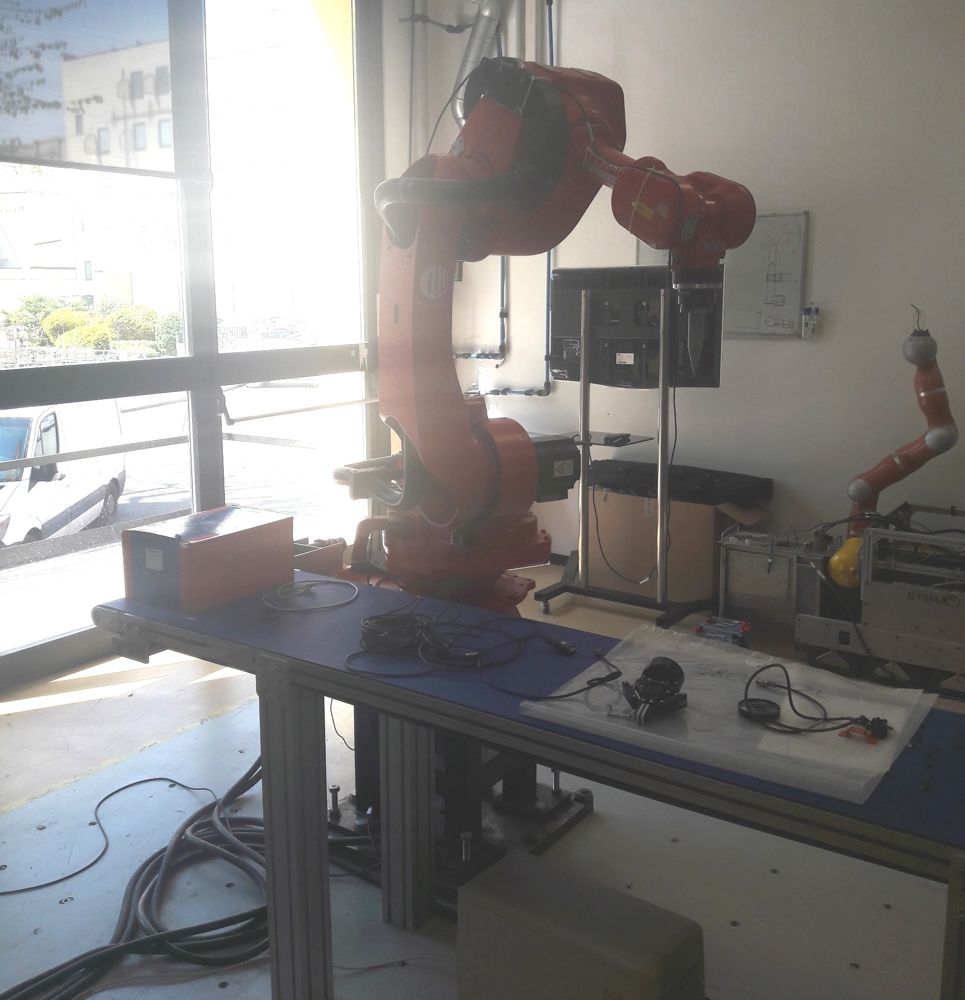
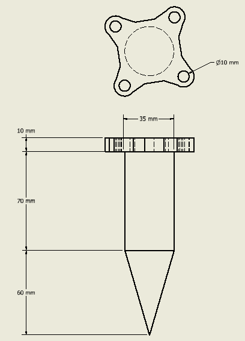
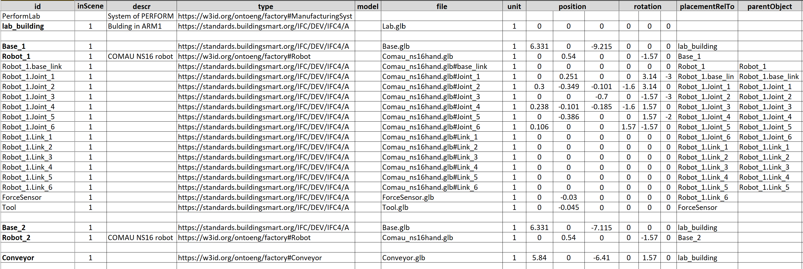
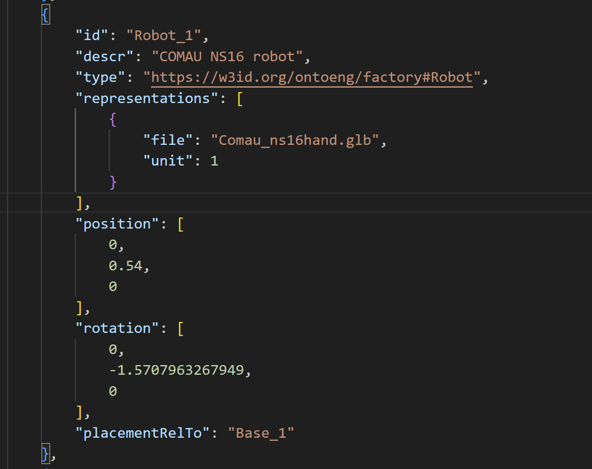
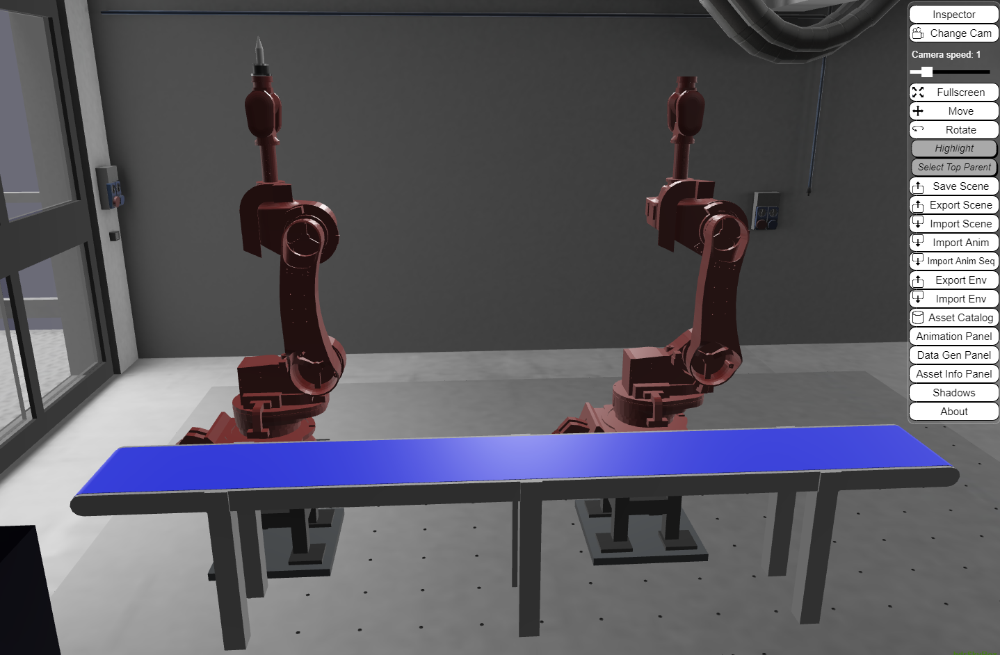

# **AVATAR Joint Learning Lab - VR & Robotics Lab**


This document presents a practical guide to support the JLL activities that will take place at CNR-STIIMA taking advantage of its robotics lab, named PERFORM Lab.
The activities are related to developing and updating the digital twin of the PERFORM Lab through a learning workflow based on VR technologies. Therefore, special attention is paid to the technical steps ranging from the creation of a 3D scene to the simulation of robot trajectories.

# **1. PERFORM Lab**

The [PERFORM Lab](https://www.stiima.cnr.it/about-stiima/laboratories-and-shopfloors/personal-robotics-for-manufacturing-laboratory/?lang=en) (Personal Robotics for Manufacturing Laboratory) is devoted to the development and validation of methods for the control of industrial and collaborative robots in advanced manufacturing. The lab is structured as an open space populated by heavy industrial robots, collaborative robots and mobile manipulators, in order to create an ecosystem of interacting autonomous machines.

The lab focuses on thematic areas such as human-robot collaboration, task and motion planning, physical human-robot interaction, rapid sorting, human-robot and robot-robot co-manipulation. These topics have applications in various areas in manufacturing, including waste sorting, assembly and disassembly, and pick and pack.

A digital twin of the lab has been developed to support research and teaching activities.




*PERFORM Lab*


# **2. Workflow**

In the scope of the [AVATAR general workflow](https://avatar.gricad-pages.univ-grenoble-alpes.fr/avatar-site/00-main/01-workflows.html), the attention is focused on activities Scene creation (A1), Simulation (A2), and Operation integration (A5).

The workflow for creating an XR environment turns out to be much broader than what we will focus on. The complete scheme is shown below. More details can be found at the following link: [Avatar workflows - AVATAR (univ-grenoble-alpes.fr)](https://avatar.gricad-pages.univ-grenoble-alpes.fr/avatar-site/00-main/01-workflows.html).


 
*AVATAR general workflow*


The generic [Scene Creation workflow](https://avatar.gricad-pages.univ-grenoble-alpes.fr/avatar-site/01-workflows/010-scene-creation/010-scene-creation.html) has been instantiated for the PERFORM lab, focusing on the activities Geometry modelling (A1 Parts, A2 subassemblies) and Geometric model Scene Creation (A4).

The proposed workflow and technologies can be employed for any lab and production system, as documented for other [use cases](https://virtualfactory.gitbook.io/vlft/use-cases).


## *2.1. Definition of assets*
The PERFORM Lab consists of several assets placed in the room. Assets are basic elements composing a system, e.g. physical objects like machine tools, parts, conveyors, buffers, but also processes and plans.
Herein, only a subset of relevant assets is considered:

- COMAU robots, model NS16: `The lab houses two COMAU robots, specifically the NS16 model. These robots, referred to as Robot_1 and Robot_2, play a crucial role in the lab's activities and experiments.`
- `bases: The robots are placed on dedicated bases within the lab. There are two bases, each providing a stable platform for the respective COMAU robot.`
- workpieces: `The lab houses a number of workpieces, which are used in experiments and demonstrations. The workpieces are placed on the conveyor.`
- conveyor: `The conveyor is a key element of the lab, as it is used to transport workpieces from one location to another in some cases. The conveyor is placed in front of the two COMAU robots.`
- force sensor: `The force sensor allows the measurement and monitoring of forces exerted during robot interactions with the environment or workpieces. The force sensor provides valuable feedback for control and safety purposes.`
- tool (end effector): `The tool or end effector is an essential component attached to the robots, enabling them to perform specific actions or manipulate objects with precision. The selection of the appropriate tool depends on the task requirements.`
- robot controller: `The robot controller serves as the central unit responsible for commanding and controlling the actions of the COMAU robots. It provides the necessary interfaces and programming capabilities for operating the robots effectively.`
- desk: `The desk is a piece of furniture that is used in the lab.`

### 2.1.1. COMAU robot NS16
The characteristics of the robot are defined in the corresponding [URDF](http://wiki.ros.org/urdf/Tutorials) (Unified Robotics Description Format) package that is typically used to model robots in [ROS](http://wiki.ros.org/) (Robot Operating System) applications. In particular, the [XML URDF file](http://wiki.ros.org/urdf/XML) defines the relevant geometric and functional properties of the robot, including the position and rotation of joints and links, the feasible rotation of each joint, etc.

The [URDF package of COMAU NS16](https://github.com/CNR-STIIMA-IRAS/comau-experimental/tree/master/comau_robots/comau_ns16hand) includes [3D meshes](https://github.com/CNR-STIIMA-IRAS/comau-experimental/tree/master/comau_robots/comau_ns16hand/comau_ns16hand_support/meshes) and the XML URDF file (cf. [comau_ns16hand.urdf](https://github.com/CNR-STIIMA-IRAS/comau-experimental/blob/master/comau_robots/comau_ns16hand/comau_ns16hand_support/urdf/comau_ns16hand.urdf)). Each joint can rotate only around Z-axis.

The hierarchy of **Robot_1** consists of the following elements, where the prefix "Robot_1." is added to the joint/link name defined in the URDF file to have a unique identifier:

```
Robot_1 (root)
└ Robot_1.base_link
  └ Robot_1.Joint_1
    └ Robot_1.Link_1
      └ Robot_1.Joint_2
        └ Robot_1.Link_2
          └ Robot_1.Joint_3
            └ Robot_1.Link_3
              └ Robot_1.Joint_4
                └ Robot_1.Link_4
                  └ Robot_1.Joint_5
                    └ Robot_1.Link_5
                      └ Robot_1.Joint_6
                        └ Robot_1.Link_6
```

Finally, the *ForceSensor* is attached to *Link_6* and the *Tool* is attached to the *ForceSensor*.

---
#### Clarification
`The hierarchy mentioned above plays a crucial role in defining the movements of the COMAU NS16 robot, especially when working with animation files. The structure of the animation file requires the 'Links' to serve as the unique identifiers for objects(nodes), while the 'Joints' act as reference points located between the links to facilitate their movement.

By following the hierarchy, where each "Link" is connected through its corresponding "Joint," it becomes possible to accurately map the motion of the robot. The animation file relies on this hierarchical structure to correctly associate the desired actions with the specific components of the robot.

Therefore, understanding the hierarchy and properly aligning the "Links" and "Joints" is essential for creating animations that accurately represent the intended movements of the COMAU NS16 robot.`
---

`NOTE 1`
The URDF package adopts the following **conventions** to define the position and rotation of joints and links: Z-up (i.e. Z is the vertical axis); Euler angles XYZ extrinsic (corresponding to ZYX intrinsic)

---


### 2.1.2. 3D models of assets
The 3D models of the assets are available on a [GitHub repository](https://github.com/difactory/repository/tree/main/models/VL/PERFORM) in [gLFT format](https://www.khronos.org/gltf/), specifically the binary version .glb.
The 3D models of the laboratory building, controller, and table were already developed in the past during research activities. The robot 3D model includes nodes for joints and links according to the information in the URDF file; in addition, links are associated with meshes. The 3D model of robot base, conveyor, force sensor and tool were developed with the collaboration of Polimi students (drawings are available upon request).

| Asset               | 3D model                                                                                          |
|---------------------|---------------------------------------------------------------------------------------------------|
| COMAU robot NS16    | [Comau_ns16hand.glb](https://difactory.github.io/repository/models/VL/PERFORM/Comau_ns16hand.glb) |
| Robot base          | [Base.glb](https://difactory.github.io/repository/models/VL/PERFORM/Base.glb)                     |
| Controller          | [Controller.glb](https://difactory.github.io/repository/models/VL/PERFORM/Controller.glb)         |
| Conveyor            | [Conveyor.glb](https://difactory.github.io/repository/models/VL/PERFORM/Conveyor.glb)             |
| Force Sensor        | [ForceSensor.glb](https://difactory.github.io/repository/models/VL/PERFORM/ForceSensor.glb)       |
| Lab building        | [Lab.glb](https://difactory.github.io/repository/models/VL/PERFORM/Lab.glb)                       |
| Table               | [Table.glb](https://difactory.github.io/repository/models/VL/PERFORM/Table.glb)                   |
| Tool (end effector) | [Tool.glb](https://difactory.github.io/repository/models/VL/PERFORM/Tool.glb)                     |
| Workpiece           | [Workpiece.glb](https://difactory.github.io/repository/models/VL/PERFORM/Workpiece.glb)           |

The .glb file of the robot ([Comau_ns16hand.glb](https://difactory.github.io/repository/models/VL/PERFORM/Comau_ns16hand.glb)) explicitly contains the definition of all its [elements in the hierarchy](#211-comau-robot-ns16). 

The measurements of the robot *Tool* are provided in the following drawing.



*Drawing of the robot tool*


If additional 3D models were needed, then several options can be explored:
1. Reuse of existing models published in online libraries that can be downloaded (free or with a fee). The 3D models should be available in a neutral format (e.g. .STEP or .IGES) that can be later modified and converted to .gLTF/.glb, e.g. using [Blender](https://www.blender.org/).
2. 3D models can be created from scratch using any 3D CAD (e.g. Inventor, SketchUP, Solidworks) or 3D modeling (e.g. Blender, 3ds Max) software tool.
3. 3D scanning of objects and spaces.

More details about the development of [3D models and generation of gLTF files](https://virtualfactory.gitbook.io/vlft/kb/instantiation/3d-models) can be found in a specific documentation.


## *2.2. Scene configuration*
The scene configuration defines the properties of the assets and place them in the layout. Herein, a particular workflow is adopted (see Figure), but other approaches can be followed depending on the available data and target application.


*Possible workflow for the scene configuration*

---

`NOTE 2`
The instantiation workflow reported in this section adopts the following **conventions** to define the position and rotation of assets in the scene: Y-up (i.e. Y is the vertical axis); Euler angles YXZ intrinsic

---

### 2.2.1. Scene configuration - Spreadsheet table

The scene configuration can be defined in a spreadsheet structured according to a [predefined template](https://virtualfactory.gitbook.io/vlft/kb/instantiation/assets/spreadsheet). The sheet *“assets”* constains the list of assets with properties (e.g. 3D model, placement). The sheet *“context”* has cells where it is possible to define the unit of measurment for lengths and the Z-up/Y-up convention; in addition a cell (B1) can be copied to extract the content of the spreadsheet as a JSON file.

The spreadsheet table for the PERFORM Lab is [available online](https://difactory.github.io/repository/spreadsheets/VL_STIIMA_PERFORM.xlsx). Also in this case the unit of measurement is meter and the Y-up convention is adopeted.



*Scene configuration in a spreadsheet table*

### 2.2.2. Scene configuration - JSON

The scene configuration can be defined in a JSON file according to a specific [JSON schema](https://virtualfactory.gitbook.io/vlft/kb/instantiation/assets/json). [JSON (JavaScript Object Notation)](https://www.json.org/json-en.html) is a lightweight text-based data-interchange format that is easy to read/parse and write/generate both for humans and machines. A .json file can be opened with any basic or advanced text editor (e.g. [NotePad++](https://notepad-plus-plus.org/downloads/), [Visual Studio Code](https://code.visualstudio.com/)).

The JSON file for the PERFORM Lab is [PERFORM.json](https://difactory.github.io/repository/scenes/VL/PERFORM.json). In this case the unit of measurement is meter and the Y-up convention is adopeted.



*Scene configuration in a JSON file, example of "Robot_1" asset*

### 2.2.3. Scene configuration - Ontology

Finally, the scene configuration can be defined as an [OWL ontology](https://www.w3.org/TR/owl2-overview/) that instantiates the [Factory Data Model](https://virtualfactory.gitbook.io/vlft/kb/fdm). The tool [OntoGuiWeb](https://virtualfactory.gitbook.io/vlft/tools/ontoguiweb) can support the instantiation.

## *2.3. Visualization in VR environment*

The 3D scene can be visualized using several VR tools/environments, such as Unity, UnrealEngine, Godot, BabylonJS, etc. 

Herein, [VEB.js](https://virtualfactory.gitbook.io/vlft/tools/vebjs) (**V**irtual **E**nvironment based on **B**abylon.**js**) prototype tool is employed, taking advantage of its reconfigurable model-driven approach. 

Any browser can be used to visualize the [PERFORM Lab with VEB.js](https://difactory.github.io/DF/scenes/VL/PERFORM_glb.html).

The documentation of VEB.js provides details about its [functionalities](https://virtualfactory.gitbook.io/vlft/tools/vebjs/functionalities), [I/O files](https://virtualfactory.gitbook.io/vlft/tools/vebjs/input-output). 
The use of the app can be personalized in terms of [scene](https://virtualfactory.gitbook.io/vlft/tools/vebjs/input-output#scene), [animation](https://virtualfactory.gitbook.io/vlft/tools/vebjs/input-output#animation), [environment](https://virtualfactory.gitbook.io/vlft/tools/vebjs/input-output#environment), and [configuration](https://virtualfactory.gitbook.io/vlft/tools/vebjs/input-output#configuration) by:
1. Loading files from a local repository using specific commands in the [toolbar](https://virtualfactory.gitbook.io/vlft/tools/vebjs/functionalities#2.-toolbar)
2. Defininig [URL parameters](https://virtualfactory.gitbook.io/vlft/tools/vebjs#url-parameters) that point to online resources on a remote repository


[GitHub](https://github.com/) can be used to freely create [remote repositories](https://virtualfactory.gitbook.io/vlft/kb/instantiation/datarepo/remote#online-repository-for-binary-text-files) for binary and text files to launch VEB.js with personal settings.




*Visualization of PERFORM Lab in VEB.js*

## *2.4. Simulation*

The planning, management, and monitoring of robots are a complex task that can be supported by specific software tools, e.g. [Gazebo](https://gazebosim.org/home), [RoboDK](https://robodk.com/), [Process Simulate](https://plm.sw.siemens.com/en-US/tecnomatix/products/process-simulate-software/), and ROS-based tools like [MoveIt](https://moveit.ros.org/).

The attention is focused on the simulation of robot trajectories. However, the actual generation of these trajectories is out of scope as they are taken as input. Specifically, robot trajectories for the PERFORM Lab were generating using ROS-MoveIt. 

### 2.4.1. Robot Monitoring

During the execution of the trajectory, the robot controller can communicate the joint state (i.e. position, velocity, force/torque, etc.) that in turn can be stored (e.g. in a text-based file) or published (e.g. via [MQTT](#25-mqtt-communication)). Herein, we take in consideration only the joint position, i.e. the rotation angle of the joint.
The joint angles are likely to be measured by sensors or encoders that are attached to the robot joints. These sensors can generate data at a high rate, potentially several times per second or even faster, depending on the specific application and the performance requirements.

The joint positions of the robot in the PERFORM Lab are saved at 10 Hz (i.e. one position is stored every 0.1 [s]) in a JSON file that contains a list of position items, where each item defines the angles of the joints in **radians** [rad]. Here below an example of item is shown:

    {
        "J1": 0.0,
        "J2": 0.0,
        "J3": 1.57,
        "J4": 0.0,
        "J5": -1.57,
        "J6": 0.0,
        "J7": 0.0,
        "J8": 0.0,
        "J9": 0.0,
        "J10": 0.0
    }

Each item of the list reports by default the value of 10 joint angles. Robot_1 of PERFORM Lab consists of 6 joints, therefore only joints from "J1" to "J6" contain relevant values while the others (from "J7" to "J10") will be always set to zero.

---

`NOTE 3`
Based on the structure of the robot generated after its [URDF package](#211-comau-robot-ns16), the position (angle) collected during monitoring for each joint must be actually applied to the child of the joint, i.e. a link. For instance the angle of "J3" (referring to *Joint_3*) must be applied to its child link *Link_3* `[clarified here](####clarification)`.

---

An example can be seen in file [trajectory_example.json](files/trajectory_example.json) that defines a trajectory moving the tool along the vertical axis.

### 2.4.2. Robot animation in VR environment

Most of the VR environments enable interactions and animations that can be exploited to visualize the exectution of robot trajectories. However, the messages generated during [robot monitoring](#241-robot-monitoring) require an elaboration with the addition of contextual data to support a proper animation.
Herein, the animation of assets in a VR scene can be formalized according to a specific [JSON schema](https://virtualfactory.gitbook.io/vlft/kb/instantiation/animations) that enables the definition of several events, such as *show*, *hide*, *animation*, *state*, etc. 

---

`NOTE 4`
Also the instantiation of the animation JSON file follows the **conventions** Y-up and Euler angles YXZ intrinsic.

---

According to the content of the [URDF file](#211-comau-robot-ns16), all robot joints can rotate only around Z-axis in a Z-up convention. This means that the rotation angle collected during monitoring must be converted into a rotation around Y-axis, while preserving the sign of the angle. For instance, a +1.57 [rad] angle for "J3" (i.e. *Joint_3*) means a rotation around Z-axis that is converted into a rotation [0, +1.57, 0] radians of *Link_3* (cf. `NOTE 3`).

The animation corresponding to the [example trajectory](files/trajectory_example.json) is provided in file [PERFORM_anim.json](https://difactory.github.io/repository/scenes/VL/PERFORM_anim.json).

The animation of the [example trajectory can be played in VEB.js](https://difactory.github.io/DF/scenes/VL/PERFORM_glb.html) pushing the play button in the [animation panel](https://virtualfactory.gitbook.io/vlft/tools/vebjs/functionalities#4.-animation-panel).


## *2.5. MQTT Communication*


[MQTT](https://mqtt.org/) (Message Queuing Telemetry Transport) is a lightweight, publish-subscribe messaging protocol that is commonly used in the Internet of Things (IoT) and other applications. 

MQTT can be exploited for bi-directional communications with robots:
- sending feedback about joint states: `The robot can publish messages containing detailed information about its current joint states. These messages are sent to a specific MQTT broker with a known address. By subscribing to the broker, other components or systems that require real-time feedback from the robot can easily receive these messages and stay updated with the latest joint state information.`
- receiving commands for the execution of trajectories: `Commands and instructions for the desired trajectory execution can be sent over MQTT. These commands can include joint angles for single moment, or predefined trajectory consists of multiple joint angles. The robot subscribes to these command topics and acts upon the received instructions accordingly.`

### 2.5.1 MQTT development

Different programming languages can be used to develop MQTT clients, e.g. JavaScript and Pyhton libraries.
In addition to publishers and subscribers, the MQTT architecture needs a broker to manage messages.

Several resources are freely available online to develop MQTT architectures:
- tools to develop and test MQTT architecture/components (e.g. MQTTLens)
- free public MQTT broker (e.g. [broker.emqx.io](https://www.emqx.com/en/mqtt/public-mqtt5-broker))
- desktop MQTT client (e.g. [MQTTX](https://mqttx.app/))
- tutorials on MQTT and related tools (e.g. [this](http://www.steves-internet-guide.com/using-mqtt-lens/))
- libraries to develop MQTT components (e.g. [MQTT.js](https://www.npmjs.com/package/mqtt))


### 2.5.2 MQTT and VR & Robotics Lab

The robot controller can publish a message containing the current [joint states](#241-robot-monitoring). Because of security resons, the messages can be generated by an emulator of the robot controller that is launched using the web application [OntoGuiWeb](https://virtualfactory.gitbook.io/vlft/tools/ontoguiweb).  Specifically, the module [MQTT Sync](https://virtualfactory.gitbook.io/vlft/tools/ontoguiweb/modules/mqtt-sync) provides functionalities as an MQTT client to publish messages and subscribe to topics. 

VEB.js can play the role of both [publisher and subscriber](https://virtualfactory.gitbook.io/vlft/tools/vebjs/functionalities#4.-animation-panel), exchanging messages that are structured to the [animation json](#242-robot-animation-in-vr-environment) schema.


