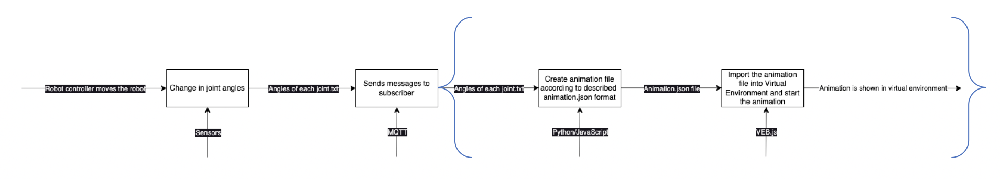
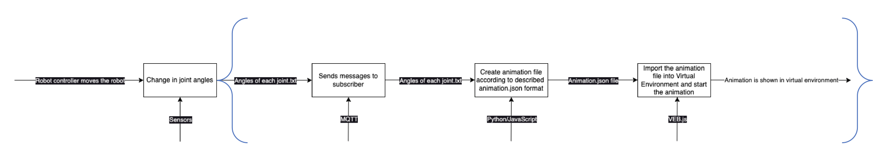

# **Challenge #1 - Visualize Trajectories**
### Task T.1.1
In the initial stage, it is recommended to access the provided link for accessing the virtual environment, specifically the [VEB.js visualization](http://ec2-54-174-51-194.compute-1.amazonaws.com/vebjs/?inputscene=https://difactory.github.io/repository/scenes/VL/PERFORM-C1.json&repoMod3d=https://difactory.github.io/repository/models/VL/PERFORM/&inputanim=linkToBeAdded&inputenv=https://difactory.github.io/repository/scenes/VL/PERFORM-C1_env.json&inputconfig=). Following this, the objects desired in the task should be found by utilizing either the toolbar -> inspector functionality or performing a manual search. Subsequently, if an object of interest is not visually distinguished, it can be highlighted by selecting the object and utilizing the highlight button on the toolbar. Finally, for capturing screenshots, one can employ the screenshot feature available on the computer or alternatively, utilize the [Data Generation Panel](https://virtualfactory.gitbook.io/vlft/tools/vebjs/functionalities#5.-data-generation-panel) to facilitate the automatic capture of screenshots.
### Task T.1.2

We require a python (or another) script capable of converting raw trajectory data into the animation.json format, which can then be visualized using VEB.js. For reference, you can examine the provided [raw trajectory data](https://github.com/difactory/DF/blob/main/docs/AVATAR-JLL/files/trajectory_example.json) and the desired [animation.json format](https://difactory.github.io/repository/scenes/VL/PERFORM_anim.json). As an example, we created a python script and added some comments to clarify it:
```
import json

# Import the trajectory file (in JSON format) to be converted into an animation file (also in JSON format)
with open("trajectory.json", "r") as read_file:
    # Assign the imported trajectory to the mylist variable
    mylist = json.load(read_file)

def conv(data):
    # Create a dictionary (second_dict) to be used while creating the animation file
    second_dict = {}
    
    # Specify the variables in the context section of the animation file
    second_dict["context"] = {
        "assetTrail": False,
        "UnitOfMeasureScale": 1,
        "Zup": False,
        "RepoAnim": ""
    }

    # Create sections for nodes, sequences, and bookmarks as part of the animation file 
    second_dict["nodes"] = []
    second_dict["sequences"] = []
    second_dict["bookmarks"] = []

    # Initialize the actual time to 0
    actual_time = 0

    for name, value in data[0].items():
        # Create a node for each joint and assign an ID according to the robot's hierarchy
        # There are 10 joints in the trajectory file, but only 6 of them are available in the robot and the rest are not used
        if int(name[1:]) <= 6:
            # Assign the initial rotation of each joint

            # Each joint can rotate only around the Z-axis according to the URDF file, which has a Z-up coordinate system.
            # However, we need to rotate around the Y-axis according to the animation file, which has a Y-up coordinate system. So assign the value to the Y-axis.
            node = {
                "id": "Robot_1.Link_" + name[1:],
                "actions": [
                    {
                        "trigger": {
                            "type": "timestamp",
                            "data": str(actual_time)
                        },
                        "event": {
                            "type": "show",
                            "rotation": [0, value, 0],
                            "placementRelTo": "Robot_1.Joint_" + name[1:]
                        }
                    }
                ]
            }
            
            # Append each node to the nodes section of the animation file initially
            second_dict["nodes"].append(node)
    
    # For each time step in the trajectory file, create an action for each joint and assign the rotation values to each joint
    for link in data[1:]:
        # Increment the actual time according to the time step of the trajectory file
        actual_time += 100 

        # Iterate through the joints and create an action for each joint for each time step
        for name, value in link.items():
            if int(name[1:]) <= 6:
                # Create an action for each joint, assign the rotation and time values to each joint
                action = {
                    "trigger": {
                        "type": "timestamp",
                        "data": str(actual_time)
                    },
                    "event": {
                        "type": "show",
                        "rotation": [0, value, 0],
                        "placementRelTo": "Robot_1.Joint_" + name[1:]
                    }
                }
                # Append each action to the actions section of the related node (joint)
                second_dict["nodes"][int(name[1:])-1]["actions"].append(action)
    
    # We have action sequences for each joint in the nodes section of the animation file

    # Create an animation file in JSON format and write the second_dict, which has the animation file format, to the file
    with open("animation.json", "w") as outfile:
        json.dump(second_dict, outfile) 
    outfile.close()
           
conv(mylist)
read_file.close()
```

### Task T.1.3
Once the animation.json file has been acquired, it can be uploaded to VEB.js for visualization. To accomplish this, navigate to the [toolbar](https://virtualfactory.gitbook.io/vlft/tools/vebjs/functionalities#2.-toolbar) and select the "import anim" option. Following the successful upload, the animation can be initiated by accessing [the animation panel](https://virtualfactory.gitbook.io/vlft/tools/vebjs/functionalities#4.-animation-panel).

### Task T.1.4
To evaluate the trajectory execution, we can measure the distance between the top of the tool and the origin of the target (workpiece) upon completion of the animation. To simplify the distance measurement process, we can utilize the [asset info panel](https://virtualfactory.gitbook.io/vlft/tools/vebjs/functionalities#6.-asset-info-panel). Here's a step-by-step procedure:

1. Select the target object (workpiece) within the scene.
2. Click on the "Set Reference Asset" option in the asset info panel.
3. Next, select the tool and click on the "Add" button on the asset info panel.
4. Subsequently, click on the "Export JSON" button on the asset info panel.
5. In the generated JSON file, you will find the relative coordinates of the tool's origin in relation to the target's origin.
6. By subtracting [the length of the tool](https://github.com/difactory/DF/blob/main/docs/AVATAR-JLL/images/Tool_measurements.PNG) from the relative coordinates, the relative location of the tool tip can be determined.
7. Finally, calculate the distance using the Pythagorean theorem based on the obtained coordinates.

This approach allows for a straightforward measurement of the distance and assessment of the tool's positioning in relation to the target.

Additionally, collision detection can be visually assessed directly.

# **Challenge #2 - Receive a Trajectory via MQTT**

You can gain an understanding of the outlined workflow for Challenge #2 by referring to the information provided above.
### Task T.2.1
To begin, access the [OntoGuiWeb](https://virtualfactory.gitbook.io/vlft/tools/ontoguiweb) platform and locate the MQTT Sync button. Click on it to proceed. Next, subscribe to any desired topic. 
To capture the necessary data, open the developer console in your Chrome browser (or any other browser of your choice). Right-click on the website and select "Inspect". In the inspect panel, navigate to the console section. Before clicking on the "Start Publish" button for Challenge#2 Sequence, ensure that you have the console panel selected. Once ready, click on the "Start Publish" button. 
Allow the messages to conclude, and then right-click within the console page. Choose the option to "Save As" to save the console logs. 
After saving the console logs, you can utilize the following Python code to create a trajectory:
```
import json

def extract_json_lines(log_file_path):
    json_lines = []  # List to store extracted JSON lines
    
    with open(log_file_path, 'r') as file:
        log_lines = file.readlines()  # Read all lines from the log file
        
        for line in log_lines:
            line = line.strip()  # Remove leading/trailing whitespace
            
            if "Full message received" in line:
                start_index = line.index("{")  # Find the starting index of the JSON object
                new = eval(line[start_index:])  # Evaluate the JSON object as Python code
                json_lines.append(new)  # Append the extracted JSON object to the list

    with open("trajectory_from_consolelog.json", "w") as outfile: # address of the output file
        json.dump(json_lines, outfile)  # Write the extracted JSON objects to a JSON file

    outfile.close()  # Close the output file

log_file_path = "ec2-54-174-51-194.compute-1.amazonaws.com-1686381038556.log" # Path to the log file
extract_json_lines(log_file_path)
```
### Task T.2.2
Using the trajectory file obtained in Task T.2.1 as input, execute the Python script developed in Task T.1.2 to convert the trajectory into an animation.json file.

### Task T.2.3
Import the animation.json file obtained as an output of Task T.2.2 into the [VEB.js visualization](http://ec2-54-174-51-194.compute-1.amazonaws.com/vebjs/?inputscene=https://difactory.github.io/repository/scenes/VL/PERFORM-C2.json&repoMod3d=https://difactory.github.io/repository/models/VL/PERFORM/&inputanim=linkToBeAdded&inputenv=https://difactory.github.io/repository/scenes/VL/PERFORM-C2_env.json). Execute the animation and visually inspect the trajectory for verification.

### Task T.2.4
Follow the same procedure as Task T.1.4 for the animation being visualized in Task T.2.3.

### Task T.2.5 (_**Bonus**_)
The python script is given below but there is some important points to clarify:
1) Be sure # topic to subscribe address is correct, you will get message coming to this address.
2) Be sure # topic to publish address is correct, your virtual environment must be subscribed to this address.
3) First run the code, then click on the "Start Publish" button for Challenge#2 Sequence
The python script:

```
import paho.mqtt.client as mqtt

# MQTT callback functions
def on_connect(client, userdata, flags, rc):
    if rc == 0:
        print("Connected to MQTT broker")
        client.subscribe("/DF/anim/json/ProductionLine") # Topic to subscribe
    else:
        print("Connection failed with error code", rc)

def on_message(client, userdata, msg):
    traj = eval(msg.payload.decode())
    sending_message = conv(traj)
    publish_message(client, sending_message)

def publish_message(client, message):
    # Publish the message to the same client
    topic = "/DF/anim/json/RoboticCell" # Topic to publish
    payload = str(message)
    client.publish(topic, payload)

def conv(data):
    # create a dictionary (second_dict) to utilize while creating the animation file
    second_dict = {}
    
    # specify the variables in the context section of animation file
    second_dict["context"] = {"assetTrail": False, "UnitOfMeasureScale": 1, "Zup": False, "RepoAnim": ""}

    # create nodes, sequences, and bookmarks sections as a part of animation file 
    second_dict["nodes"] = []
    for name, value in data.items():
        # create a node for each joint and assign the id according to the hierarchy of the robot
        # there is 10 joints in the trajectory file, but only 6 of them are avaliable in the robot and the rest are not used
        if int(name[1:]) <= 6:
            # assign the initial rotation of each joint

            # each joint can rotate only around Z-axis according to URDF file that has Z-up coordinate system,
            # but we need to rotate around Y-axis according to the animation file that has Y-up coordinate system so assign the value to Y-axis
            node = {
                "id": "Robot_1.Link_" + name[1:],
                "actions": [{
                    "event": {"type": "show", "rotation": [0, value, 0], "placementRelTo": "Robot_1.Joint_" + name[1:]}
                }]
            }

            # append each node to the nodes section of the animation file initially
            second_dict["nodes"].append(node)
    return second_dict

# Create MQTT client instance
client = mqtt.Client()

# Assign callback functions
client.on_connect = on_connect
client.on_message = on_message

# Connect to the broker
broker_url = "broker.emqx.io"
broker_port = 1883
client.connect(broker_url, broker_port)

# Start the MQTT loop
client.loop_forever()

```
  
# **Challenge #3 - Generate a Trajectory**
### Task T.3.1
In this particular case, we do not have the complete trajectory required to generate the animation. However, we have the initial position provided in the task and the final position, which corresponds to the joint angles of the robot when the tool tip reaches the hole of Workpiece_1. Various tools can be employed to generate this trajectory. As an example, we can provide a straightforward Python script that generates a trajectory based on the initial and final joint angles. Additionally, the number of iterations should be specified, taking into account the velocity of the robot's movements. Increasing the number of iterations results in a slower velocity of the movements. Here is a basic Python script example for generating the trajectory:
```
import json

def trajectory_create(initial_position, target_position, num_of_steps):
    # Create an empty list to store the trajectory
    trajectory = []
    
    # Generate the trajectory by interpolating between the initial and target positions
    for i in range(num_of_steps):
        step = {}
        
        # Interpolate each position parameter based on the current step
        for name, value in initial_position.items():
            step[name] = value + (target_position[name] - value) * (i / num_of_steps)
        
        # Append the interpolated step to the trajectory
        trajectory.append(step)
    
    # Write the trajectory to a JSON file
    with open("generated_traj.json", "w") as outfile:
        json.dump(trajectory, outfile)  # Write the extracted JSON objects to a JSON file
    outfile.close()  # Close the output file
    
initial_position = {
    "J1": 0,
    "J2": 0,
    "J3": -1.57,
    "J4": 0,
    "J5": 1.57,
    "J6": 0
}
target_position = {
    "J1": 0.538,
    "J2": 0.7637362481385295,
    "J3": -1.8800761286392603,
    "J4": -0.10164862748520956,
    "J5": 0.4487,
    "J6": 0.5795
}

trajectory_create(initial_position, target_position, 100)
```
The provided code generates a trajectory based solely on the starting point, the end point, and the number of steps. However, it lacks collision information. To ensure collision avoidance, it is possible to create safe routes by specifying intermediate waypoints. One way to obtain joint angles for these waypoints is by manually adjusting the robot within the VEB.js environment and exporting the scene to obtain the corresponding joint angles. 
By making certain adjustments to the code above, we can develop a version that allows the definition of intermediate waypoints. Additionally, the movement speed of the robot can be dynamically adjusted according to the distances between these waypoints. Presented below is an updated Python code that incorporates these customizations:
```
import numpy as np
import json

def trajectory_create(*args):
    """
    Generates a trajectory by interpolating between given positions.

    Args:
        *args: The first argument must be the initial position and target positions must be added respectively.
               The last argument must be the total number of steps.
        Format of position variables: position = {"J1": 0,"J2": 0,"J3": -1.57,"J4": 0,"J5": 1.57,"J6": 0}
    Returns:
        None
    """
    # Create an empty list to store the trajectory
    trajectory = []
    
    # Extract the points and number of steps from the input arguments
    points = args[:-1]
    num_of_steps = args[-1]
    
    # Calculate the weights for each segment based on the differences between points
    weights = np.array([])
    difference = []
    for i in range(len(points) - 1):
        difference[i] = sum(abs(np.array(list(points[i+1].values())) - np.array(list(points[i].values()))))
    
    # Calculate the weights as the ratio of each difference to the total difference
    for i in range(len(points) - 1):
        weights[i] = difference[i] / sum(difference)
    
    # Calculate the number of steps for each segment based on the weights
    partial_num_of_steps = weights * num_of_steps
    
    # Generate the trajectory by interpolating between the points
    for i in range(len(points) - 1):
        for j in range(partial_num_of_steps):
            step = {}
            
            # Interpolate each position parameter based on the current step and partial number of steps
            for name, value in points[i].items():
                step[name] = value + (points[i + 1][name] - value) * (j / int(partial_num_of_steps[i]))
            
            # Append the interpolated step to the trajectory
            trajectory.append(step)
    
    # Append the last point to the trajectory
    trajectory.append(points[-1])
    
    # Write the trajectory to a JSON file
    with open("generated_traj.json", "w") as outfile:
        json.dump(trajectory, outfile)
    outfile.close()
    
initial_position = {
    "J1": 0,
    "J2": 0,
    "J3": -1.57,
    "J4": 0,
    "J5": 1.57,
    "J6": 0
}
middle_position = {
    "J1": 0.5976,
    "J2": 0.4833,
    "J3": -1.9479,
    "J4": -0.0893,
    "J5": 0.5846,
    "J6": 0.5093
}
target_position = {
    "J1": 0.538,
    "J2": 0.7637362481385295,
    "J3": -1.8800761286392603,
    "J4": -0.10164862748520956,
    "J5": 0.4487,
    "J6": 0.5795
}

trajectory_create(initial_position, middle_position, target_position, 100)
```
### Task T.3.2
Using the trajectory file obtained in Task T.3.1 as input, execute the Python script developed in Task T.1.2 to convert the trajectory into an animation.json file.
### Task T.3.3
Import the animation.json file obtained as an output of Task T.3.2 into the [VEB.js visualization](http://ec2-54-174-51-194.compute-1.amazonaws.com/vebjs/?inputscene=https://difactory.github.io/repository/scenes/VL/PERFORM-C3.json&repoMod3d=https://difactory.github.io/repository/models/VL/PERFORM/&inputanim=linkToBeAdded&inputenv=https://difactory.github.io/repository/scenes/VL/PERFORM-C3_env.json). Execute the animation and visually inspect the trajectory for verification.
### Task T.3.4
Follow the same procedure as Task T.1.4 for the animation being visualized in Task T.3.3.
